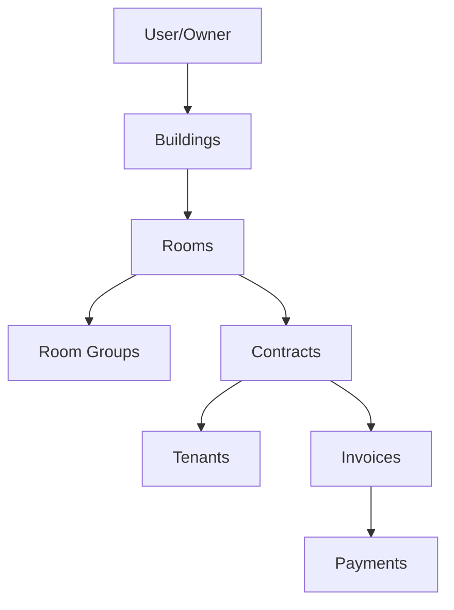

# Claude Agent Guidelines for Room Manager Project

> **Tài liệu này dành cho các AI agent (Claude) khi làm việc với dự án Room Manager. Đây là hướng dẫn chi tiết về kiến trúc, quy ước, và cách thức làm việc với codebase.**

## Tổng Quan Dự Án

**Room Manager** là một hệ thống quản lý nhà trọ/phòng cho thuê toàn diện, hỗ trợ đa ngôn ngữ (Tiếng Anh & Tiếng Việt).

### Tính Năng Chính
- **Authentication**: JWT-based với refresh tokens
- **Quản lý Tòa nhà (Buildings)**: Nhiều tòa nhà/bất động sản
- **Quản lý Phòng (Rooms)**: Trạng thái, giá, tình trạng phòng với hỗ trợ 2 loại phòng (trọ dài hạn, ngắn hạn)
- **Nhóm Phòng (Room Groups)**: Phân loại phòng theo nhóm
- **Khách thuê (Tenants)**: Thông tin và lịch sử khách thuê
- **Hợp đồng (Contracts)**: Quản lý hợp đồng với các kỳ thanh toán khác nhau
- **Hóa đơn (Invoices)**: Tự động tạo và theo dõi hóa đơn
- **Thanh toán (Payments)**: Ghi nhận và giám sát thanh toán

---

## Tech Stack

### Backend (`/backend`)
| Công nghệ | Mục đích |
|-----------|----------|
| **NestJS** | Framework chính |
| **MongoDB + Mongoose** | Database |
| **Passport + JWT** | Authentication |
| **nestjs-i18n** | Đa ngôn ngữ backend |
| **class-validator** | DTO validation với decorators |
| **Winston** | Logging |

### Frontend (`/frontend`)
| Công nghệ | Mục đích |
|-----------|----------|
| **React 18 + TypeScript** | Framework UI |
| **Vite** | Build tool |
| **Tailwind CSS** | Styling |
| **Zustand** | State management |
| **React Query (TanStack)** | Server state |
| **Zod** | Form validation |
| **react-i18next** | Đa ngôn ngữ frontend |
| **Radix UI** | Headless UI components |
| **Lucide React** | Icons |

---

## Cấu Trúc Thư Mục

```
room-manager/
├── backend/
│   └── src/
│       ├── common/           # Shared utilities
│       │   ├── constants/    # Enums (RoomStatus, RoomType, etc.)
│       │   ├── decorators/   # Custom decorators
│       │   ├── dto/          # Shared DTOs
│       │   ├── filters/      # Exception filters (i18n-validation)
│       │   ├── guards/       # Auth guards
│       │   └── interceptors/ # Request/response interceptors
│       ├── config/           # Database config
│       ├── i18n/             # Translation files (en/, vi/)
│       │   ├── en/           # 11 JSON files
│       │   └── vi/           # 11 JSON files  
│       └── modules/          # Feature modules
│           ├── auth/         # Login, register, JWT
│           ├── users/        # User management
│           ├── buildings/    # Building CRUD
│           ├── rooms/        # Room CRUD (complex pricing)
│           ├── room-groups/  # Room grouping
│           ├── tenants/      # Tenant management
│           ├── contracts/    # Contract management
│           ├── invoices/     # Invoice generation
│           └── payments/     # Payment tracking
├── frontend/
│   ├── public/
│   │   └── locales/          # Translation files (en/, vi/)
│   └── src/
│       ├── api/              # API clients (axios)
│       │   ├── client.ts     # Axios instance with interceptors
│       │   └── auth.api.ts   # Auth API calls
│       ├── components/       # Reusable components
│       │   ├── forms/        # Form components (BuildingForm, RoomForm, etc.)
│       │   └── ui/           # Base UI (Button, Dialog, Input, etc.)
│       ├── hooks/            # Custom hooks
│       ├── layouts/          # DashboardLayout
│       ├── lib/              # Utilities
│       │   ├── utils.ts      # Helper functions
│       │   └── validations.ts # Zod schemas với i18n
│       ├── pages/            # Page components per module
│       ├── stores/           # Zustand stores
│       │   ├── authStore.ts  # Auth state với persist
│       │   ├── buildingStore.ts
│       │   └── themeStore.ts
│       └── utils/            # Additional utilities
├── .agent/
│   └── workflows/            # Agent workflows
│       ├── run-project.md    # How to run the project
│       ├── rebuild-docker.md # Docker rebuild steps
│       └── do-changes.md     # Change implementation workflow
└── docker-compose.yml        # Docker deployment
```

---

## Module Pattern (Backend)

Mỗi module trong `/backend/src/modules/` tuân theo cấu trúc:

```
modules/[module-name]/
├── dto/
│   └── [module].dto.ts       # CreateDto, UpdateDto
├── schemas/
│   └── [module].schema.ts    # Mongoose schema
├── [module].controller.ts    # REST endpoints
├── [module].service.ts       # Business logic
└── [module].module.ts        # NestJS module
```

### Ví dụ: Room Module

```typescript
// room.schema.ts - Định nghĩa MongoDB schema
@Schema({ timestamps: true })
export class Room {
    @Prop({ type: Types.ObjectId, ref: 'Building', required: true })
    buildingId: Types.ObjectId;
    
    @Prop({ type: Types.ObjectId, ref: 'User', required: true })
    ownerId: Types.ObjectId;  // Multi-tenant support
    
    @Prop({ type: String, enum: RoomType, required: true })
    roomType: RoomType;  // LONG_TERM | SHORT_TERM
    
    // ... other fields
}
```

---

## Enums Quan Trọng

Định nghĩa tại `backend/src/common/constants/enums.ts`:

```typescript
// Loại phòng
enum RoomType {
    LONG_TERM = 'LONG_TERM',   // Phòng trọ dài hạn
    SHORT_TERM = 'SHORT_TERM', // Phòng ngắn hạn
}

// Giá phòng ngắn hạn
enum ShortTermPricingType {
    HOURLY = 'HOURLY',   // Theo giờ
    DAILY = 'DAILY',     // Theo ngày
    FIXED = 'FIXED',     // Giá cố định
}

// Trạng thái phòng
enum RoomStatus {
    AVAILABLE = 'AVAILABLE',
    OCCUPIED = 'OCCUPIED',
    MAINTENANCE = 'MAINTENANCE',
}

// Trạng thái hóa đơn
enum InvoiceStatus {
    PENDING = 'PENDING',
    PARTIAL = 'PARTIAL',
    PAID = 'PAID',
    OVERDUE = 'OVERDUE',
}

// Phương thức thanh toán
enum PaymentMethod {
    CASH = 'CASH',
    BANK_TRANSFER = 'BANK_TRANSFER',
    MOMO = 'MOMO',
    ZALOPAY = 'ZALOPAY',
    OTHER = 'OTHER',
}
```

---

## Mô Hình Giá Phòng

### Phòng Dài Hạn (LONG_TERM)
```typescript
{
    defaultRoomPrice: number,      // Giá phòng/tháng
    defaultElectricPrice: number,  // Giá điện/số
    defaultWaterPrice: number,     // Giá nước/số
    defaultTermMonths: number,     // Kỳ hạn mặc định
}
```

### Phòng Ngắn Hạn (SHORT_TERM)
```typescript
{
    shortTermPricingType: 'HOURLY' | 'DAILY' | 'FIXED',
    
    // Nếu HOURLY
    hourlyPricingMode: 'PER_HOUR' | 'TABLE',
    pricePerHour?: number,           // Nếu PER_HOUR
    shortTermPrices?: PriceTier[],   // Nếu TABLE
    
    // Nếu DAILY
    shortTermPrices: PriceTier[],    // Bảng giá theo ngày
    
    // Nếu FIXED
    fixedPrice: number,
}

// PriceTier structure
interface PriceTier {
    fromValue: number,  // Giờ/ngày bắt đầu (tier đầu luôn = 0)
    toValue: number,    // Giờ/ngày kết thúc (-1 = còn lại)
    price: number,      // Giá cho tier này
}
```

---

## Validation Pattern

### Backend (class-validator)
```typescript
// backend/src/modules/rooms/dto/room.dto.ts
export class CreateRoomDto {
    @IsMongoId()
    @IsNotEmpty()
    buildingId: string;

    @IsNumber()
    @Min(1)
    floor: number;

    @IsEnum(RoomType)
    @IsNotEmpty()
    roomType: RoomType;
    
    // ... validation decorators
}
```

### Frontend (Zod + i18n)
```typescript
// frontend/src/lib/validations.ts
export const useRoomSchema = () => {
    const { t } = useTranslation();
    
    return z.object({
        buildingId: z.string().min(1, t('validation.required', { field: t('rooms.building') })),
        roomType: z.enum(['LONG_TERM', 'SHORT_TERM']),
        // ...
    }).superRefine((data, ctx) => {
        // Complex cross-field validation
        if (data.roomType === 'LONG_TERM') {
            if (data.defaultRoomPrice <= 0) {
                ctx.addIssue({
                    code: z.ZodIssueCode.custom,
                    message: t('validation.min', { field: t('rooms.defaultRoomPrice'), min: 1 }),
                    path: ['defaultRoomPrice'],
                });
            }
        }
    });
};
```

---

## i18n Structure

### Backend Translations
```
backend/src/i18n/
├── en/
│   ├── auth.json
│   ├── buildings.json
│   ├── common.json
│   ├── contracts.json
│   ├── fields.json
│   ├── invoices.json
│   ├── payments.json
│   ├── rooms.json
│   ├── tenants.json
│   ├── users.json
│   └── validation.json
└── vi/
    └── ... (same structure)
```

### Frontend Translations
```
frontend/public/locales/
├── en/
│   └── translation.json
└── vi/
    └── translation.json
```

### Sử dụng trong code
```typescript
// Frontend
const { t } = useTranslation();
t('rooms.roomName')  // Trả về tên phòng theo ngôn ngữ hiện tại

// Backend - trong DTOs, messages được translate tự động
// Language header: Accept-Language hoặc x-lang
```

---

## API Client Pattern

```typescript
// frontend/src/api/client.ts
const apiClient = axios.create({
    baseURL: import.meta.env.VITE_API_URL || 'http://localhost:3000/api',
});

// Auto-attach JWT token và language header
apiClient.interceptors.request.use((config) => {
    const token = localStorage.getItem('token');
    if (token) {
        config.headers.Authorization = `Bearer ${token}`;
    }
    config.headers['Accept-Language'] = i18n.language;
    config.headers['x-lang'] = i18n.language;
    return config;
});
```

---

## State Management

### Auth Store (Zustand với persist)
```typescript
// frontend/src/stores/authStore.ts
export const useAuthStore = create<AuthState>()(
    persist(
        (set) => ({
            user: null,
            token: null,
            setAuth: (user, token) => {
                localStorage.setItem('token', token);
                set({ user, token });
            },
            logout: () => {
                localStorage.removeItem('token');
                set({ user: null, token: null });
            },
        }),
        { name: 'auth-storage' }
    )
);
```

---

## Multi-Tenant Architecture

**Quan trọng**: Tất cả các entities đều có `ownerId` để hỗ trợ multi-tenant:

```typescript
// Mỗi schema đều có
@Prop({ type: Types.ObjectId, ref: 'User', required: true, index: true })
ownerId: Types.ObjectId;

// Mỗi service đều filter theo ownerId
async findAll(ownerId: string) {
    return this.model.find({ ownerId, isDeleted: false }).sort({ createdAt: -1 });
}
```

---

## Workflows Có Sẵn

### 1. Chạy Project (`/run-project`)
```bash
# Backend (NestJS)
cd backend && npm run start:dev

# Frontend (React + Vite)  
cd frontend && npm run dev
```
- Backend: http://localhost:3000/api
- Frontend: http://localhost:5173

### 2. Rebuild Docker (`/rebuild-docker`)
```bash
docker-compose up -d --build
```

### 3. Thực hiện thay đổi (`/do-changes`)
- Đọc file CHANGES.md để xem yêu cầu
- Thực hiện các thay đổi theo danh sách

---

## Lưu Ý Quan Trọng Khi Code

### 1. Khi thêm field mới
1. Cập nhật **Schema** (`schemas/xxx.schema.ts`)
2. Cập nhật **DTO** (`dto/xxx.dto.ts`) với validation decorators
3. Cập nhật **Frontend validation** (`lib/validations.ts`)
4. Cập nhật **i18n translations** (cả en và vi)

### 2. Khi thêm module mới
1. Tạo folder trong `backend/src/modules/`
2. Tạo schema, dto, controller, service, module
3. Import vào `app.module.ts`
4. Tạo page trong `frontend/src/pages/`
5. Thêm route trong `App.tsx`
6. Thêm menu item trong `DashboardLayout.tsx`

### 3. Validation rules
- Giá tiền (price) luôn phải > 0 (dùng `@Min(1)` backend, `z.number().min(1)` hoặc superRefine frontend)
- Phone Vietnam: regex `/^(0|\+84)(3[2-9]|5[2689]|7[06-9]|8[1-9]|9[0-46-9])[0-9]{7}$/`
- Tier đầu tiên của bảng giá luôn có `fromValue = 0`

### 4. Table sorting
- Default sort: `createdAt: -1` (newest first)

### 5. Soft delete
- Tất cả entities có `isDeleted: boolean`
- Queries luôn filter `isDeleted: false`

### 6. ObjectId cho reference fields
- **BẮT BUỘC**: Khi query database với các trường ID tham chiếu đến record khác (như `ownerId`, `buildingId`, `roomId`, etc.), phải convert string sang `ObjectId`:
  ```typescript
  // ❌ SAI - so sánh string với ObjectId sẽ không match
  { buildingId: id, ownerId }
  
  // ✅ ĐÚNG - luôn convert sang ObjectId
  { buildingId: new Types.ObjectId(id), ownerId: new Types.ObjectId(ownerId) }
  ```
- Import `Types` từ mongoose: `import { Types } from 'mongoose';`

### 7. Table action buttons
- Ô action ở mỗi item trong table hiển thị các nút (Sửa, Xóa,...) **trực tiếp**, không đặt trong dropdown menu
- Sử dụng `Button` với `variant="ghost"` và `size="icon"` cho các action buttons
- Ví dụ:
  ```tsx
  <TableCell>
      <div className="flex items-center gap-1">
          <Button variant="ghost" size="icon" onClick={() => handleEdit(item)}>
              <Pencil className="h-4 w-4" />
          </Button>
          <Button variant="ghost" size="icon" onClick={() => handleDelete(item)} className="text-destructive">
              <Trash2 className="h-4 w-4" />
          </Button>
      </div>
  </TableCell>
  ```

---

## Các Lệnh Thường Dùng

```bash
# Backend
cd backend
npm run start:dev    # Dev server với hot reload
npm run build        # Build production
npm run lint         # Lint check

# Frontend
cd frontend
npm run dev          # Dev server với HMR
npm run build        # Build production
npm run preview      # Preview production build

# Docker
docker-compose up -d           # Start all services
docker-compose logs -f         # View logs
docker-compose down            # Stop services
docker-compose up -d --build   # Rebuild and start
```

---

## Environment Variables

### Backend (`.env`)
```env
NODE_ENV=development
PORT=3000
MONGODB_URI=mongodb://localhost:27017/room-manager
JWT_SECRET=your-secret-key
JWT_EXPIRES_IN=1h
REFRESH_TOKEN_SECRET=your-refresh-secret
REFRESH_TOKEN_EXPIRES_IN=7d
CORS_ORIGIN=http://localhost:5173
```

### Frontend (`.env`)
```env
VITE_API_URL=http://localhost:3000/api
```

---

## Tips Debug

1. **API Error**: Check console Network tab, xem response body
2. **Validation Error**: Frontend console + backend logs (`logs/combined.log`)
3. **Auth Issues**: Check localStorage `token`, xem expiry
4. **i18n Missing**: Console warning về missing translation keys
5. **Type Errors**: `npm run lint` hoặc VSCode TypeScript errors

---

## Liên Hệ Cấu Trúc



Mỗi entity đều thuộc về một Owner (multi-tenant), Buildings chứa Rooms, Rooms có thể thuộc Room Groups, Contracts liên kết Room với Tenant, Invoices sinh ra từ Contracts, và Payments ghi nhận thanh toán cho Invoices.
